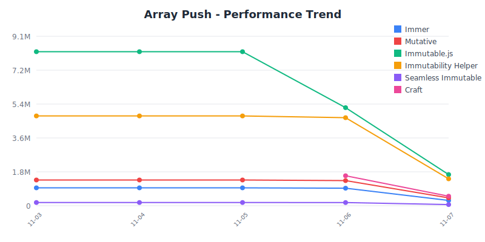
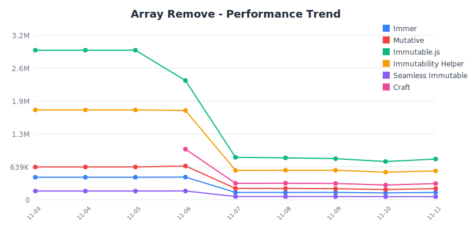
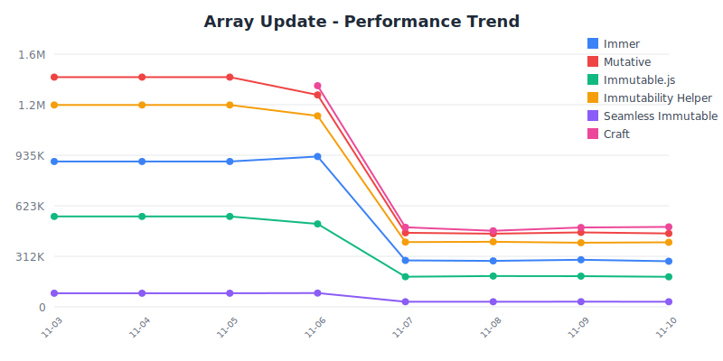
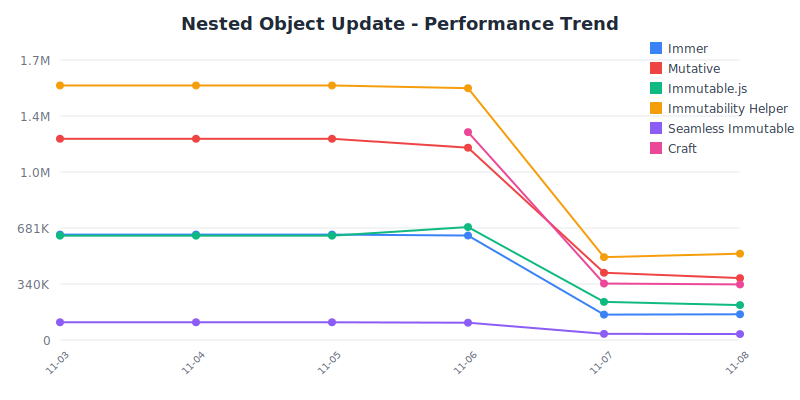
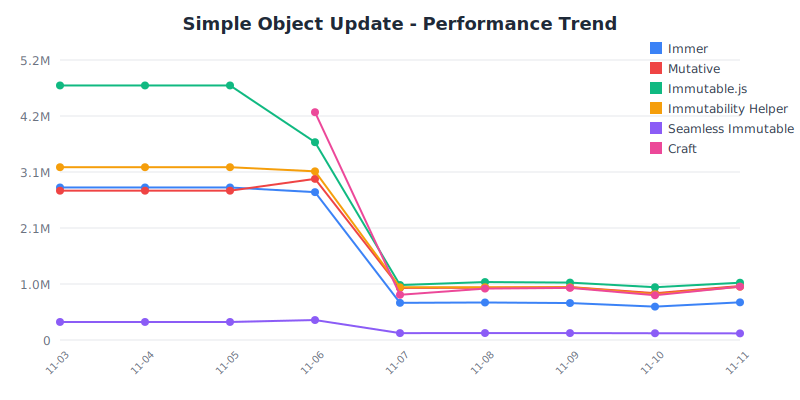

# State Management Benchmark 🏆

Professional performance comparison of JavaScript state management libraries.

## 📋 Benchmark Information

- **Last Updated:** January 1, 2025
- **Last Run:** 12:00:00 AM UTC
- **Environment:** Node.js v25.0.0, darwin arm64
- **Test Framework:** Vitest Bench
- **Iterations:** 3 runs averaged for statistical accuracy

## 📦 Library Versions

| Library | Version | Size (gzip) | Last Updated |
|---------|---------|-------------|-------------|
| **[@sylphx/craft](https://github.com/sylphxltd/craft)** | `v1.2.1` | 2.76KB | Nov 6, 2025 |
| **[immer](https://github.com/immerjs/immer)** | `v10.1.1` | 4.70KB | Nov 6, 2025 |
| **[immutability-helper](https://github.com/kolodny/immutability-helper)** | `v3.1.1` | 1.65KB | Nov 6, 2025 |
| **[immutable](https://github.com/immutable-js/immutable-js)** | `v4.3.7` | 17.74KB | Nov 6, 2025 |
| **[mutative](https://github.com/unadlib/mutative)** | `v1.1.1` | N/A | Nov 6, 2025 |
| **[seamless-immutable](https://github.com/rtfeldman/seamless-immutable)** | `v7.1.4` | 2.71KB | Nov 6, 2025 |

## 📦 Bundle Size Comparison

Smaller bundle sizes mean faster initial load times and better user experience.

| Rank | Library | Minified + Gzipped | Minified | Relative to Smallest |
|------|---------|-------------------|----------|---------------------|
| 🥇 | **[immutability-helper](https://github.com/kolodny/immutability-helper)** | 1.65KB | 4.68KB | Baseline |
| 🥈 | **[seamless-immutable](https://github.com/rtfeldman/seamless-immutable)** | 2.71KB | 7.55KB | 1.64x |
| 🥉 | **[@sylphx/craft](https://github.com/sylphxltd/craft)** | 2.76KB | 9.56KB | 1.67x |
| 📍 | **[immer](https://github.com/immerjs/immer)** | 4.70KB | 13.83KB | 2.84x |
| 📍 | **[immutable](https://github.com/immutable-js/immutable-js)** | 17.74KB | 65.04KB | 10.73x |

**Size Insight:** immutability-helper is the most lightweight at 1.65KB (gzip), while immutable is 10.73x larger at 17.74KB (gzip).

## 🏆 Top Performers

Quick overview of category winners (libraries only):

| Category | 🥇 Winner | Ops/sec | Runner-up |
|----------|-----------|---------|----------|
| **JSON Patches - Generate** | [Craft](https://github.com/sylphxltd/craft) | 844.71K | [Immer](https://github.com/immerjs/immer) (416.27K) |
| **JSON Patches - Apply** | [Craft](https://github.com/sylphxltd/craft) | 3.71M | [Immer](https://github.com/immerjs/immer) (434.07K) |
| **JSON Patches - Roundtrip** | [Craft](https://github.com/sylphxltd/craft) | 643.80K | [Immer](https://github.com/immerjs/immer) (219.92K) |
| **Map - Set Operation** | [Craft](https://github.com/sylphxltd/craft) | 2.47M | [Mutative](https://github.com/unadlib/mutative) (1.35M) |
| **Map - Update Nested Value** | [Craft](https://github.com/sylphxltd/craft) | 3.73M | [Mutative](https://github.com/unadlib/mutative) (1.17M) |
| **Set - Add Operation** | [Craft](https://github.com/sylphxltd/craft) | 2.78M | [Mutative](https://github.com/unadlib/mutative) (1.22M) |
| **Set - Delete Operation** | [Craft](https://github.com/sylphxltd/craft) | 2.62M | [Mutative](https://github.com/unadlib/mutative) (1.23M) |
| **Map - Large (100 items)** | [Craft](https://github.com/sylphxltd/craft) | 346.89K | [Mutative](https://github.com/unadlib/mutative) (305.63K) |
| **Set - Large (100 items)** | [Craft](https://github.com/sylphxltd/craft) | 1.42M | [Mutative](https://github.com/unadlib/mutative) (189.66K) |
| **Undo/Redo - Inverse Patches** | [Craft](https://github.com/sylphxltd/craft) | 594.35K | [Immer](https://github.com/immerjs/immer) (208.17K) |
| **Simple Object Update** | [Immutable.js](https://github.com/immutable-js/immutable-js) | 4.60M | [Craft](https://github.com/sylphxltd/craft) (4.22M) |
| **Nested Object Update** | [Immutability Helper](https://github.com/kolodny/immutability-helper) | 1.51M | [Craft](https://github.com/sylphxltd/craft) (1.29M) |
| **Array Push** | [Immutable.js](https://github.com/immutable-js/immutable-js) | 8.05M | [Immutability Helper](https://github.com/kolodny/immutability-helper) (4.78M) |
| **Array Remove** | [Immutable.js](https://github.com/immutable-js/immutable-js) | 2.90M | [Immutability Helper](https://github.com/kolodny/immutability-helper) (1.69M) |
| **Array Update** | [Craft](https://github.com/sylphxltd/craft) | 1.46M | [Mutative](https://github.com/unadlib/mutative) (1.45M) |
| **Deep Nested Update (5 levels)** | [Immutability Helper](https://github.com/kolodny/immutability-helper) | 823.78K | [Craft](https://github.com/sylphxltd/craft) (673.01K) |
| **Large Array Update (1000 items)** | [Mutative](https://github.com/unadlib/mutative) | 1.07M | [Immer](https://github.com/immerjs/immer) (77.67K) |
| **Multiple Updates (3 changes)** | [Immutability Helper](https://github.com/kolodny/immutability-helper) | 813.76K | [Craft](https://github.com/sylphxltd/craft) (694.24K) |

## 📜 Historical Results

Track performance changes over time:

| Date | Results | Notes |
|------|---------|-------|
| 2025-11-06 | [View Results](./results/2025-11-06.json) | Benchmark run |
| 2025-11-05 | [View Results](./results/2025-11-05.json) | Benchmark run |
| 2025-11-04 | [View Results](./results/2025-11-04.json) | Benchmark run |
| 2025-11-03 | [View Results](./results/2025-11-03.json) | Benchmark run |

> 💡 **Tip:** Compare historical results to track performance improvements or regressions over time.

### 📈 Performance Trends

Visual representation of performance over time:

**Array Push**



**Array Remove**



**Array Update**



<details>
<summary>View 2 more trend charts</summary>

**Nested Object Update**



**Simple Object Update**



</details>

## 📊 Detailed Results

### JSON Patches - Generate

**Performance Comparison:**

```
🥇 Craft                ████████████████████████████████████████ 844.71K
🥈 Immer                ████████████████████ 416.27K
```

| Rank | Library | Ops/sec | Variance | Mean | p99 | Samples |
|------|---------|---------|----------|------|-----|--------|
| 🥇 | **[Craft](https://github.com/sylphxltd/craft)** | 844.71K | ±0.33% | 1.1838ms | 2.4160ms | 422.36K |
| 🥈 | **[Immer](https://github.com/immerjs/immer)** | 416.27K | ±0.53% | 2.4023ms | 5.7500ms | 208.14K |

### JSON Patches - Apply

**Performance Comparison:**

```
🥇 Craft                ████████████████████████████████████████ 3.71M
🥈 Immer                █████ 434.07K
```

| Rank | Library | Ops/sec | Variance | Mean | p99 | Samples |
|------|---------|---------|----------|------|-----|--------|
| 🥇 | **[Craft](https://github.com/sylphxltd/craft)** | 3.71M | ±0.58% | 0.2694ms | 0.4580ms | 1.86M |
| 🥈 | **[Immer](https://github.com/immerjs/immer)** | 434.07K | ±1.01% | 2.3038ms | 5.7080ms | 217.03K |

### JSON Patches - Roundtrip

**Performance Comparison:**

```
🥇 Craft                ████████████████████████████████████████ 643.80K
🥈 Immer                ██████████████ 219.92K
```

| Rank | Library | Ops/sec | Variance | Mean | p99 | Samples |
|------|---------|---------|----------|------|-----|--------|
| 🥇 | **[Craft](https://github.com/sylphxltd/craft)** | 643.80K | ±0.30% | 1.5533ms | 1.9170ms | 321.90K |
| 🥈 | **[Immer](https://github.com/immerjs/immer)** | 219.92K | ±0.33% | 4.5472ms | 6.2920ms | 109.96K |

### Map - Set Operation

**Performance Comparison:**

```
🥇 Craft                ████████████████████████████████████████ 2.47M
🥈 Mutative             ██████████████████████ 1.35M
🥉 Immer                ██████████ 586.96K
```

| Rank | Library | Ops/sec | Variance | Mean | p99 | Samples |
|------|---------|---------|----------|------|-----|--------|
| 🥇 | **[Craft](https://github.com/sylphxltd/craft)** | 2.47M | ±1.33% | 0.4050ms | 0.8330ms | 1.23M |
| 🥈 | **[Mutative](https://github.com/unadlib/mutative)** | 1.35M | ±0.41% | 0.7404ms | 1.7080ms | 675.33K |
| 🥉 | **[Immer](https://github.com/immerjs/immer)** | 586.96K | ±0.24% | 1.7037ms | 2.0840ms | 293.48K |

**Key Insight:** Craft is **4.21x faster** than Immer in this category.

### Map - Update Nested Value

**Performance Comparison:**

```
🥇 Craft                ████████████████████████████████████████ 3.73M
🥈 Mutative             █████████████ 1.17M
🥉 Immer                █████ 475.20K
```

| Rank | Library | Ops/sec | Variance | Mean | p99 | Samples |
|------|---------|---------|----------|------|-----|--------|
| 🥇 | **[Craft](https://github.com/sylphxltd/craft)** | 3.73M | ±0.43% | 0.2682ms | 0.4160ms | 1.86M |
| 🥈 | **[Mutative](https://github.com/unadlib/mutative)** | 1.17M | ±0.42% | 0.8579ms | 1.2920ms | 582.80K |
| 🥉 | **[Immer](https://github.com/immerjs/immer)** | 475.20K | ±0.37% | 2.1044ms | 2.7920ms | 237.60K |

**Key Insight:** Craft is **7.85x faster** than Immer in this category.

### Set - Add Operation

**Performance Comparison:**

```
🥇 Craft                ████████████████████████████████████████ 2.78M
🥈 Mutative             ██████████████████ 1.22M
🥉 Immer                ███████ 500.99K
```

| Rank | Library | Ops/sec | Variance | Mean | p99 | Samples |
|------|---------|---------|----------|------|-----|--------|
| 🥇 | **[Craft](https://github.com/sylphxltd/craft)** | 2.78M | ±0.31% | 0.3592ms | 0.4590ms | 1.39M |
| 🥈 | **[Mutative](https://github.com/unadlib/mutative)** | 1.22M | ±0.38% | 0.8188ms | 1.1670ms | 610.66K |
| 🥉 | **[Immer](https://github.com/immerjs/immer)** | 500.99K | ±0.31% | 1.9960ms | 2.5000ms | 250.50K |

**Key Insight:** Craft is **5.56x faster** than Immer in this category.

### Set - Delete Operation

**Performance Comparison:**

```
🥇 Craft                ████████████████████████████████████████ 2.62M
🥈 Mutative             ███████████████████ 1.23M
🥉 Immer                █████████ 579.61K
```

| Rank | Library | Ops/sec | Variance | Mean | p99 | Samples |
|------|---------|---------|----------|------|-----|--------|
| 🥇 | **[Craft](https://github.com/sylphxltd/craft)** | 2.62M | ±0.32% | 0.3818ms | 0.5000ms | 1.31M |
| 🥈 | **[Mutative](https://github.com/unadlib/mutative)** | 1.23M | ±0.40% | 0.8111ms | 1.3750ms | 616.46K |
| 🥉 | **[Immer](https://github.com/immerjs/immer)** | 579.61K | ±0.17% | 1.7253ms | 2.1670ms | 289.81K |

**Key Insight:** Craft is **4.52x faster** than Immer in this category.

### Map - Large (100 items)

**Performance Comparison:**

```
🥇 Craft                ████████████████████████████████████████ 346.89K
🥈 Mutative             ███████████████████████████████████ 305.63K
🥉 Immer                ███████████████████ 162.56K
```

| Rank | Library | Ops/sec | Variance | Mean | p99 | Samples |
|------|---------|---------|----------|------|-----|--------|
| 🥇 | **[Craft](https://github.com/sylphxltd/craft)** | 346.89K | ±0.42% | 2.8828ms | 3.8750ms | 173.45K |
| 🥈 | **[Mutative](https://github.com/unadlib/mutative)** | 305.63K | ±0.47% | 3.2719ms | 4.6250ms | 152.82K |
| 🥉 | **[Immer](https://github.com/immerjs/immer)** | 162.56K | ±3.73% | 6.1516ms | 14.8750ms | 81.28K |

**Key Insight:** Craft is **2.13x faster** than Immer in this category.

### Set - Large (100 items)

**Performance Comparison:**

```
🥇 Craft                ████████████████████████████████████████ 1.42M
🥈 Mutative             █████ 189.66K
🥉 Immer                █ 33.25K
```

| Rank | Library | Ops/sec | Variance | Mean | p99 | Samples |
|------|---------|---------|----------|------|-----|--------|
| 🥇 | **[Craft](https://github.com/sylphxltd/craft)** | 1.42M | ±0.39% | 0.7043ms | 1.3340ms | 710.07K |
| 🥈 | **[Mutative](https://github.com/unadlib/mutative)** | 189.66K | ±0.32% | 5.2725ms | 7.2910ms | 94.83K |
| 🥉 | **[Immer](https://github.com/immerjs/immer)** | 33.25K | ±0.55% | 30.0768ms | 39.5420ms | 16.63K |

**Key Insight:** Craft is **42.70x faster** than Immer in this category.

### Undo/Redo - Inverse Patches

**Performance Comparison:**

```
🥇 Craft                ████████████████████████████████████████ 594.35K
🥈 Immer                ██████████████ 208.17K
```

| Rank | Library | Ops/sec | Variance | Mean | p99 | Samples |
|------|---------|---------|----------|------|-----|--------|
| 🥇 | **[Craft](https://github.com/sylphxltd/craft)** | 594.35K | ±0.34% | 1.6825ms | 2.1660ms | 297.18K |
| 🥈 | **[Immer](https://github.com/immerjs/immer)** | 208.17K | ±0.38% | 4.8037ms | 6.5420ms | 104.09K |

### Simple Object Update

**Performance Comparison:**

```
🥇 Immutable.js         ████████████████████████████████████████ 4.60M
🥈 Craft                █████████████████████████████████████ 4.22M
🥉 Immutability Helper  ███████████████████████████ 3.11M
📍 Mutative             ██████████████████████████ 2.99M
📍 Immer                ███████████████████████ 2.69M
📍 Seamless Immutable   ███ 365.28K
```

| Rank | Library | Ops/sec | Variance | Mean | p99 | Samples |
|------|---------|---------|----------|------|-----|--------|
| 🥇 | **Native Spread** | 45.93M | ±0.10% | 0.0218ms | 0.0420ms | 22.97M |
| 🥈 | **[Immutable.js](https://github.com/immutable-js/immutable-js)** | 4.60M | ±0.35% | 0.2172ms | 0.2920ms | 2.30M |
| 🥉 | **[Craft](https://github.com/sylphxltd/craft)** | 4.22M | ±1.18% | 0.2367ms | 0.2920ms | 2.11M |
| 📍 | **[Immutability Helper](https://github.com/kolodny/immutability-helper)** | 3.11M | ±0.36% | 0.3212ms | 0.4170ms | 1.56M |
| 📍 | **[Mutative](https://github.com/unadlib/mutative)** | 2.99M | ±0.82% | 0.3346ms | 0.4590ms | 1.49M |
| 📍 | **[Immer](https://github.com/immerjs/immer)** | 2.69M | ±0.79% | 0.3713ms | 0.5420ms | 1.35M |
| 📍 | **[Seamless Immutable](https://github.com/rtfeldman/seamless-immutable)** | 365.28K | ±2.13% | 2.7376ms | 3.3750ms | 182.64K |

**Key Insight:** Native Spread is **125.75x faster** than Seamless Immutable in this category.

### Nested Object Update

**Performance Comparison:**

```
🥇 Immutability Helper  ████████████████████████████████████████ 1.51M
🥈 Craft                ██████████████████████████████████ 1.29M
🥉 Mutative             ████████████████████████████████ 1.19M
📍 Immutable.js         ██████████████████ 675.12K
📍 Immer                █████████████████ 633.54K
📍 Seamless Immutable   ███ 104.41K
```

| Rank | Library | Ops/sec | Variance | Mean | p99 | Samples |
|------|---------|---------|----------|------|-----|--------|
| 🥇 | **Native Spread** | 36.44M | ±0.12% | 0.0274ms | 0.0420ms | 18.22M |
| 🥈 | **[Immutability Helper](https://github.com/kolodny/immutability-helper)** | 1.51M | ±0.59% | 0.6621ms | 0.8340ms | 755.17K |
| 🥉 | **[Craft](https://github.com/sylphxltd/craft)** | 1.29M | ±0.61% | 0.7741ms | 1.0000ms | 645.89K |
| 📍 | **[Mutative](https://github.com/unadlib/mutative)** | 1.19M | ±0.67% | 0.8372ms | 1.1250ms | 597.24K |
| 📍 | **[Immutable.js](https://github.com/immutable-js/immutable-js)** | 675.12K | ±2.39% | 1.4812ms | 1.8750ms | 337.56K |
| 📍 | **[Immer](https://github.com/immerjs/immer)** | 633.54K | ±0.53% | 1.5784ms | 2.0000ms | 316.77K |
| 📍 | **[Seamless Immutable](https://github.com/rtfeldman/seamless-immutable)** | 104.41K | ±0.41% | 9.5780ms | 14.7500ms | 52.20K |

**Key Insight:** Native Spread is **348.99x faster** than Seamless Immutable in this category.

### Array Push

**Performance Comparison:**

```
🥇 Immutable.js         ████████████████████████████████████████ 8.05M
🥈 Immutability Helper  ████████████████████████ 4.78M
🥉 Craft                ████████ 1.57M
📍 Mutative             ██████ 1.27M
📍 Immer                ████ 875.08K
📍 Seamless Immutable   █ 172.87K
```

| Rank | Library | Ops/sec | Variance | Mean | p99 | Samples |
|------|---------|---------|----------|------|-----|--------|
| 🥇 | **Native Spread** | 36.00M | ±2.31% | 0.0278ms | 0.0420ms | 18.00M |
| 🥈 | **[Immutable.js](https://github.com/immutable-js/immutable-js)** | 8.05M | ±0.90% | 0.1242ms | 0.2080ms | 4.02M |
| 🥉 | **[Immutability Helper](https://github.com/kolodny/immutability-helper)** | 4.78M | ±0.27% | 0.2093ms | 0.2500ms | 2.39M |
| 📍 | **[Craft](https://github.com/sylphxltd/craft)** | 1.57M | ±0.73% | 0.6386ms | 0.8330ms | 783.02K |
| 📍 | **[Mutative](https://github.com/unadlib/mutative)** | 1.27M | ±0.86% | 0.7856ms | 1.0000ms | 636.46K |
| 📍 | **[Immer](https://github.com/immerjs/immer)** | 875.08K | ±0.84% | 1.1428ms | 1.4590ms | 437.54K |
| 📍 | **[Seamless Immutable](https://github.com/rtfeldman/seamless-immutable)** | 172.87K | ±0.25% | 5.7847ms | 7.1250ms | 86.44K |

**Key Insight:** Native Spread is **208.22x faster** than Seamless Immutable in this category.

### Array Remove

**Performance Comparison:**

```
🥇 Immutable.js         ████████████████████████████████████████ 2.90M
🥈 Immutability Helper  ███████████████████████ 1.69M
🥉 Craft                ██████████████ 998.82K
📍 Mutative             █████████ 621.11K
📍 Immer                ██████ 415.62K
📍 Seamless Immutable   ██ 168.03K
```

| Rank | Library | Ops/sec | Variance | Mean | p99 | Samples |
|------|---------|---------|----------|------|-----|--------|
| 🥇 | **Native Filter** | 39.46M | ±0.68% | 0.0253ms | 0.0420ms | 19.73M |
| 🥈 | **[Immutable.js](https://github.com/immutable-js/immutable-js)** | 2.90M | ±0.36% | 0.3447ms | 0.5410ms | 1.45M |
| 🥉 | **[Immutability Helper](https://github.com/kolodny/immutability-helper)** | 1.69M | ±0.39% | 0.5911ms | 0.7500ms | 845.82K |
| 📍 | **[Craft](https://github.com/sylphxltd/craft)** | 998.82K | ±0.29% | 1.0012ms | 1.2090ms | 499.41K |
| 📍 | **[Mutative](https://github.com/unadlib/mutative)** | 621.11K | ±0.67% | 1.6100ms | 2.0420ms | 310.55K |
| 📍 | **[Immer](https://github.com/immerjs/immer)** | 415.62K | ±0.37% | 2.4061ms | 3.0000ms | 207.81K |
| 📍 | **[Seamless Immutable](https://github.com/rtfeldman/seamless-immutable)** | 168.03K | ±0.44% | 5.9513ms | 8.2500ms | 84.02K |

**Key Insight:** Native Filter is **234.85x faster** than Seamless Immutable in this category.

### Array Update

**Performance Comparison:**

```
🥇 Craft                ████████████████████████████████████████ 1.46M
🥈 Mutative             ████████████████████████████████████████ 1.45M
🥉 Immutability Helper  ██████████████████████████████████ 1.23M
📍 Immer                ██████████████████████████ 944.33K
📍 Immutable.js         ███████████████ 535.11K
📍 Seamless Immutable   ██ 89.68K
```

| Rank | Library | Ops/sec | Variance | Mean | p99 | Samples |
|------|---------|---------|----------|------|-----|--------|
| 🥇 | **Native Map** | 33.25M | ±1.16% | 0.0301ms | 0.0830ms | 16.62M |
| 🥈 | **[Craft](https://github.com/sylphxltd/craft)** | 1.46M | ±0.22% | 0.6837ms | 0.8750ms | 731.28K |
| 🥉 | **[Mutative](https://github.com/unadlib/mutative)** | 1.45M | ±0.33% | 0.6905ms | 0.9170ms | 724.13K |
| 📍 | **[Immutability Helper](https://github.com/kolodny/immutability-helper)** | 1.23M | ±0.49% | 0.8135ms | 1.0410ms | 614.61K |
| 📍 | **[Immer](https://github.com/immerjs/immer)** | 944.33K | ±0.33% | 1.0590ms | 1.3330ms | 472.17K |
| 📍 | **[Immutable.js](https://github.com/immutable-js/immutable-js)** | 535.11K | ±1.29% | 1.8688ms | 2.3330ms | 267.56K |
| 📍 | **[Seamless Immutable](https://github.com/rtfeldman/seamless-immutable)** | 89.68K | ±0.36% | 11.1511ms | 13.5420ms | 44.84K |

**Key Insight:** Native Map is **370.76x faster** than Seamless Immutable in this category.

### Deep Nested Update (5 levels)

**Performance Comparison:**

```
🥇 Immutability Helper  ████████████████████████████████████████ 823.78K
🥈 Craft                █████████████████████████████████ 673.01K
🥉 Mutative             ██████████████████████████████ 608.67K
📍 Immutable.js         ███████████████████████ 467.72K
📍 Immer                ███████████████ 303.72K
📍 Seamless Immutable   ███ 63.76K
```

| Rank | Library | Ops/sec | Variance | Mean | p99 | Samples |
|------|---------|---------|----------|------|-----|--------|
| 🥇 | **Native Spread** | 24.41M | ±0.51% | 0.0410ms | 0.0830ms | 12.21M |
| 🥈 | **[Immutability Helper](https://github.com/kolodny/immutability-helper)** | 823.78K | ±0.84% | 1.2139ms | 1.9590ms | 411.89K |
| 🥉 | **[Craft](https://github.com/sylphxltd/craft)** | 673.01K | ±0.75% | 1.4859ms | 1.8750ms | 336.50K |
| 📍 | **[Mutative](https://github.com/unadlib/mutative)** | 608.67K | ±0.31% | 1.6429ms | 2.0840ms | 304.33K |
| 📍 | **[Immutable.js](https://github.com/immutable-js/immutable-js)** | 467.72K | ±0.75% | 2.1380ms | 2.7090ms | 233.86K |
| 📍 | **[Immer](https://github.com/immerjs/immer)** | 303.72K | ±0.51% | 3.2925ms | 3.8330ms | 151.86K |
| 📍 | **[Seamless Immutable](https://github.com/rtfeldman/seamless-immutable)** | 63.76K | ±0.47% | 15.6844ms | 19.9160ms | 31.88K |

**Key Insight:** Native Spread is **382.93x faster** than Seamless Immutable in this category.

### Large Array Update (1000 items)

**Performance Comparison:**

```
🥇 Mutative             ████████████████████████████████████████ 1.07M
🥈 Immer                ███ 77.67K
🥉 Craft                ██ 41.94K
📍 Immutability Helper  █ 13.80K
📍 Immutable.js          2.00K
📍 Seamless Immutable    726.84
```

| Rank | Library | Ops/sec | Variance | Mean | p99 | Samples |
|------|---------|---------|----------|------|-----|--------|
| 🥇 | **[Mutative](https://github.com/unadlib/mutative)** | 1.07M | ±0.58% | 0.9340ms | 1.6250ms | 535.35K |
| 🥈 | **Native Map** | 557.80K | ±0.26% | 1.7928ms | 2.2090ms | 278.90K |
| 🥉 | **[Immer](https://github.com/immerjs/immer)** | 77.67K | ±0.25% | 12.8743ms | 17.2500ms | 38.84K |
| 📍 | **[Craft](https://github.com/sylphxltd/craft)** | 41.94K | ±2.33% | 23.8441ms | 41.9160ms | 20.97K |
| 📍 | **[Immutability Helper](https://github.com/kolodny/immutability-helper)** | 13.80K | ±0.20% | 72.4885ms | 83.5830ms | 6.90K |
| 📍 | **[Immutable.js](https://github.com/immutable-js/immutable-js)** | 2.00K | ±0.43% | 498.7757ms | 678.4160ms | 1.00K |
| 📍 | **[Seamless Immutable](https://github.com/rtfeldman/seamless-immutable)** | 726.84 | ±0.54% | 1375.8136ms | 1621.7920ms | 364.00 |

**Key Insight:** Mutative is **1473.08x faster** than Seamless Immutable in this category.

### Multiple Updates (3 changes)

**Performance Comparison:**

```
🥇 Immutability Helper  ████████████████████████████████████████ 813.76K
🥈 Craft                ██████████████████████████████████ 694.24K
🥉 Mutative             ████████████████████████████ 565.88K
📍 Immutable.js         ███████████████████ 387.13K
📍 Immer                ██████████████████ 375.52K
📍 Seamless Immutable   ███ 52.68K
```

| Rank | Library | Ops/sec | Variance | Mean | p99 | Samples |
|------|---------|---------|----------|------|-----|--------|
| 🥇 | **Native Spread** | 29.97M | ±0.37% | 0.0334ms | 0.0420ms | 14.99M |
| 🥈 | **[Immutability Helper](https://github.com/kolodny/immutability-helper)** | 813.76K | ±0.70% | 1.2289ms | 1.5000ms | 406.88K |
| 🥉 | **[Craft](https://github.com/sylphxltd/craft)** | 694.24K | ±0.68% | 1.4404ms | 1.7910ms | 347.12K |
| 📍 | **[Mutative](https://github.com/unadlib/mutative)** | 565.88K | ±0.26% | 1.7671ms | 2.2080ms | 282.94K |
| 📍 | **[Immutable.js](https://github.com/immutable-js/immutable-js)** | 387.13K | ±1.28% | 2.5831ms | 6.0000ms | 193.57K |
| 📍 | **[Immer](https://github.com/immerjs/immer)** | 375.52K | ±0.24% | 2.6629ms | 3.2500ms | 187.76K |
| 📍 | **[Seamless Immutable](https://github.com/rtfeldman/seamless-immutable)** | 52.68K | ±0.71% | 18.9828ms | 25.4580ms | 26.34K |

**Key Insight:** Native Spread is **568.95x faster** than Seamless Immutable in this category.

## 🚀 Running Benchmarks

```bash
# Install dependencies
npm install

# Run benchmarks
npm run benchmark
```

## ℹ️ About

This benchmark is automatically updated daily by GitHub Actions. Benchmarks run only when:
- A library releases a new version
- Test files are modified

**Methodology:** Each test runs multiple iterations until statistical significance is achieved. Results are averaged over 3 complete runs to ensure accuracy.

---

*Last generated: 2025-11-06T20:11:12.710Z*
